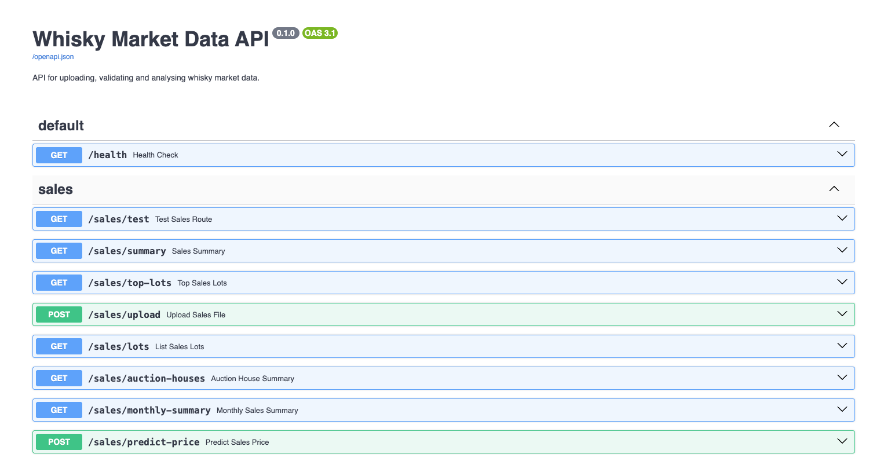
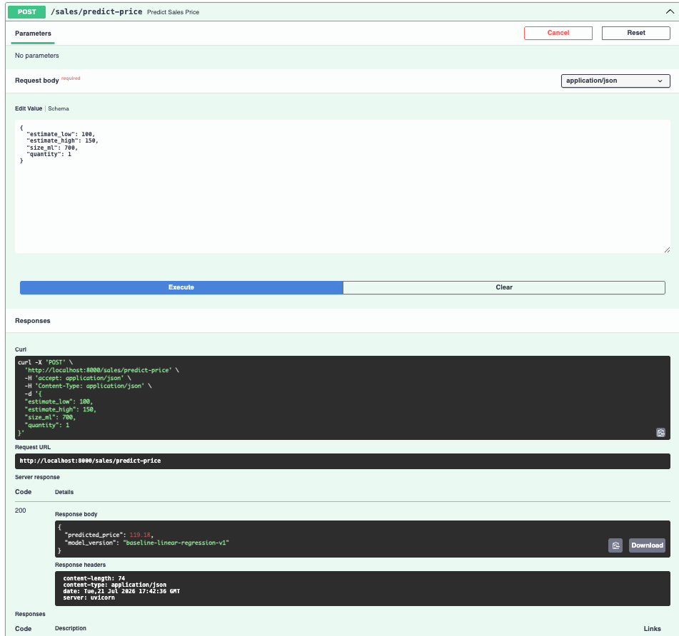
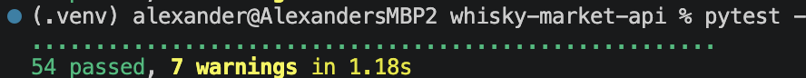

# Whisky Market Data API

A FastAPI project for working with whisky auction-style data.

The API lets you upload a CSV, checks the expected columns are there, cleans up messy scraped fields, stores the results in SQLite, and exposes query and analytics endpoints.

I built this as a portfolio project to practise production-style Python data work: API design, data validation, cleaning, SQL storage, automated testing, Docker, and a simple ML prediction endpoint.

The repo uses synthetic sample data only. It is based on the kind of whisky market data problems I have worked with before, but it does not include any private, client-owned or proprietary datasets.

---

## Project Status

Portfolio v1 complete.

The project currently includes:

- CSV upload endpoint
- required-column validation
- cleaning/parsing for auction result fields
- SQLite storage with SQLAlchemy
- query and analytics endpoints
- automated tests with pytest
- Docker support
- baseline ML price prediction workflow
- API endpoint for model inference

The ML model is deliberately simple. The main point is to show the workflow around the model: feature preparation, train/test evaluation, saving/loading the model, validating API inputs, and serving a prediction through FastAPI.

---

## What the API Does

Current data flow:

```text
CSV upload
→ required-column validation
→ data cleaning and parsing
→ upload summary
→ SQLite storage
→ query and analytics endpoints
```

Main endpoints include:

```text
GET  /health
POST /sales/upload
GET  /sales/lots
GET  /sales/summary
GET  /sales/top-lots
GET  /sales/auction-houses
GET  /sales/monthly-summary
POST /sales/predict-price
```

Interactive API docs are available at:

```text
http://localhost:8000/docs
```

---

## Tech Stack

- Python
- FastAPI
- SQLAlchemy
- SQLite
- pandas
- scikit-learn
- joblib
- pytest
- Docker

---

## Setup

Create and activate a virtual environment:

```bash
python -m venv .venv
source .venv/bin/activate
```

Install dependencies:

```bash
pip install -r requirements.txt
```

Run the tests:

```bash
pytest
```

Start the API locally:

```bash
uvicorn app.main:app --reload
```

Then open:

```text
http://localhost:8000/docs
```

---

## Running with Docker Compose and PostgreSQL

The project can also be run with PostgreSQL using Docker Compose.

This starts two services:

```text
FastAPI app
PostgreSQL database
```

Start both services:

```bash
docker compose up --build -d
```

Check the services are running:

```bash
docker compose ps
```

Open the API docs:

```text
http://127.0.0.1:8000/docs
```

In this mode, the API uses PostgreSQL instead of the default local SQLite database.

The PostgreSQL connection is passed to the API container through the `DATABASE_URL` environment variable in `docker-compose.yml`.

To stop the services:

```bash
docker compose down
```

To stop the services and delete the local PostgreSQL data volume:

```bash
docker compose down -v
```

The app still defaults to SQLite when `DATABASE_URL` is not set, so it can be run simply with:

```bash
uvicorn app.main:app --reload
```

This keeps local development and testing lightweight while also supporting a more realistic PostgreSQL setup.

### Checking PostgreSQL Data

After uploading the sample CSV through the API, you can check the number of stored rows with:

```bash
docker compose exec postgres psql -U whisky_user -d whisky_market -c "SELECT COUNT(*) FROM auction_lots;"
```

Expected output after uploading the sample data once:

```text
 count
-------
    10
(1 row)
```

You can also check which tables exist in PostgreSQL with:

```bash
docker compose exec postgres psql -U whisky_user -d whisky_market -c "\dt"
```

You should see the `auction_lots` table.

---

## Sample Data

The public repo only includes synthetic sample data:

```text
data/sample/sample_auction_lots.csv
```

Real/private data is excluded from the repository.

---

## Machine Learning: Price Prediction

The project includes a simple baseline model for predicting whisky auction result prices.

Current model:

```text
Linear regression baseline
```

Current features:

- `estimate_low`
- `estimate_high`
- `size_ml`
- `quantity`

Target:

- `result_price`

The ML workflow is:

```text
cleaned data
→ feature preparation
→ train/test evaluation
→ saved model artefact
→ API-based prediction
```

This is not meant to be a highly accurate commercial pricing model. The sample dataset is small and synthetic, so the metrics are mainly a smoke test that the ML pipeline works end to end.

---

## Train the Model

Before using the prediction endpoint, train the model locally:

```bash
python -m scripts.train_price_model
```

This creates:

```text
models/price_model.joblib
```

Generated model files are ignored by Git and can be regenerated from the training script.

Example training output from the synthetic sample data:

```text
{
  "training_rows": 7,
  "test_rows": 3,
  "train_mae": 2.62,
  "test_mae": 4.26,
  "test_r2": 0.9787,
  "model_path": "models/price_model.joblib"
}
```

---

## Price Prediction Endpoint

After training the model, start the API:

```bash
uvicorn app.main:app --reload
```

Use:

```text
POST /sales/predict-price
```

Example request:

```json
{
  "estimate_low": 400,
  "estimate_high": 550,
  "size_ml": 700,
  "quantity": 1
}
```

Example response:

```json
{
  "predicted_price": 451.8,
  "model_version": "baseline-linear-regression-v1"
}
```

If the model file has not been created yet, the endpoint returns a `503 Service Unavailable` response telling the user to run the training script first.

---

## Testing

Run all tests with:

```bash
pytest
```

The test suite covers:

- cleaning/parsing logic
- API routes
- SQL repository functions
- serializers
- Pydantic schemas
- ML feature preparation
- model training/evaluation
- model saving/loading
- prediction utilities
- prediction API endpoint

---

## Notes and Limitations

This is a portfolio project, not a production deployment.

## Screenshots

### FastAPI docs



### Prediction endpoint



### Test suite



